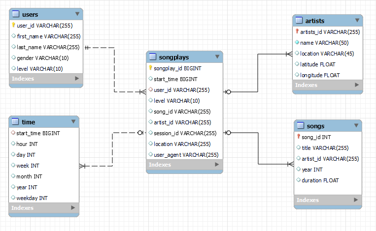

# Project: Data Lake

### Project Description

In this project,we have task with building an ETL pipeline that extracts their data from S3, processes them using Spark, and loads the data back into S3 as a set of dimensional tables.This will allow their analytics team to continue finding insights in what songs their users are listening to.

### Analysis database

Input data stored at s3 include two public bucket is log-data and song-data.Based on star schema we have schema like this
- Fact table: **songplays**
  and 4 table respectively(Dimension tables) :
- **users** : user listen in app
- **songs** : song info
- **artists** : artists info
- **time** : timestamps with specific units

Each table corresponding with output folder (data_output) with same name
The database schema is shown as follows

### Project structure

**etl.py** is where you'll load data from S3 or folder 'data' into Spark and process dataframe to write parquet file into data_output folder
**dl.cfg** - save AWS KEY
**README.md** is guideline about project

### Setup 
- Install JAVA 8 follow link : https://www.oracle.com/java/technologies/javase/javase8-archive-downloads.html
- Install python follow link : https://www.python.org/downloads/
- Install local apache spark based on link : https://phoenixnap.com/kb/install-spark-on-windows-10

### Run in windows
- Run command `py .\etl.py` to start ETL data
